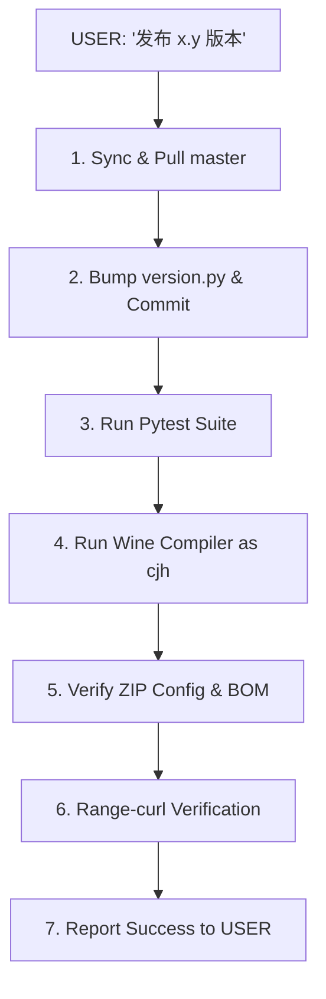

# Shopify Image Localizer EXE Explicit/Manual Release Standard

This document is the absolute source of truth (SOT) for configuring, compiling, and publishing the `Shopify Image Localizer` Windows EXE program module. Whenever the USER explicitly requests a new version release (e.g., "发布 5.4 版本"), the active agent (Gemini, Claude Code, or Codex) **must** follow this document step-by-step to perform the release.

---

## 1. Release Flow (Execution Pipeline)

When the USER requests: *"发布 x.y 版本"* (e.g., *"发布 5.4 版本"*), the developer agent **must** follow this strict pipeline:



### Step 1: Sync & Pull master
Ensure you are in the main `master` checkout on the server (`/opt/autovideosrt`):
```bash
git fetch origin master
git checkout master
git pull --ff-only origin master
git status --short --untracked-files=no
```
*Note: Staged or tracked workspace files must be clean before compiling.*

### Step 2: Bump version.py & Commit
Modify `tools/shopify_image_localizer/version.py`:
```python
RELEASE_VERSION = "x.y"  # e.g. "5.4" or "6.1"
```
Commit and push this version bump directly to `master`:
```bash
git add tools/shopify_image_localizer/version.py
git commit -m "bump: version to x.y for release"
git push origin master
```

### Step 3: Run Pytest Suite
Run unit tests to ensure no regressions in packaging or RPA core:
```bash
pytest tests/test_shopify_image_localizer_build_exe.py tests/test_shopify_image_localizer_batch_cdp.py tests/test_shopify_image_localizer_release_web.py -q
```

### Step 4: Run Wine Compiler as `cjh` User
Because the Wine environment belongs to the `cjh` user, compiling as `root` causes lock and permission errors.
Execute the compilation shell script remotely or locally on the server **under the `cjh` user**:
```bash
sudo -i -u cjh bash -c "set -e && cd /opt/autovideosrt && bash scripts/build_shopify_image_localizer_wine.sh --release-standard-read --version x.y --release-note 'Manual Release v\${version}'"
```

### Step 5: Verify ZIP Config & BOM
Inspect the zipped config files inside `/opt/autovideosrt/web/static/downloads/tools/ShopifyImageLocalizer-portable-x.y.zip`:
- Config keys (`api_key`) must match production OpenAPI Key for `openapi_materials`.
- `browser_user_data_dir` must equal `C:\chrome-shopify-image`.
- Ensure JSON configs are encoded in **UTF-8 without BOM**.

### Step 6: Range-curl Verification
Perform a quick range HTTP check to verify static download link accessibility:
```bash
curl -s -o /dev/null -w "%{http_code}" --range 0-99 http://127.0.0.1/static/downloads/tools/ShopifyImageLocalizer-portable-x.y.zip
```
*(Expected output: 200 or 206)*

### Step 7: Report Success to USER
Report the new version details, source commit, and download link to the user in a calm, professional tone.

---

## 2. Core Code Integrations (Must-Have Fixes)

All packaged EXE binaries must integrate these critical RPA/CDP fixes:
1. **Lazy-Loading Image Attributes**:
   - Replace lazy-loading image source attributes (`data-src`, `data-lazy-src`, `data-actual-src`) inside the `` tag with the new localized URL.
2. **Responsive Image Stripping**:
   - **Completely strip** `srcset` and `data-srcset` attributes from the `` tag. This forces the browser to fall back to the newly localized single high-res image.

---

## 3. Mandatory Build Configurations

The packaged portable ZIP must contain:
- `shopify_image_localizer_config.json` & `shopify_image_localizer_default_config.json`:
  - `api_key` matching the active `openapi_materials` DB provider config.
  - `browser_user_data_dir` matching `C:\chrome-shopify-image`.
  - Encoding must be **UTF-8 without BOM**.
- `release_manifest.json`:
  - Contains `source_commit` hash of `origin/master`.
