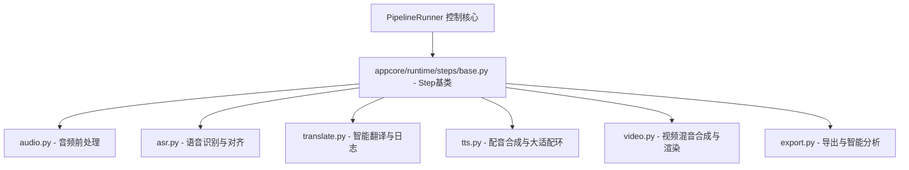

# Top 3 超大文件拆分规划方案

本方案详细梳理了项目中前三大超大文件的所有函数清单，并基于单一职责（SRP）和可维护性原则制定了具体的拆分边界、新子模块命名规范、迁移要点以及验证方案。

> [!IMPORTANT]
> 本文档为架构规划 specs，仅产出规划，在当前阶段**不修改任何源码**。

---

## 目录
- [一、 appcore/runtime/_pipeline_runner.py 拆分方案](#一-appcoreruntime_pipeline_runnerpy-拆分方案)
- [二、 appcore/order_analytics/realtime.py 拆分方案](#二-appcoreorder_analyticsrealtimepy-拆分方案)
- [三、 appcore/tasks.py 拆分方案](#三-appcoretaskspy-拆分方案)
- [四、 渐进式迁移与重构步骤](#四-渐进式迁移与重构步骤)
- [五、 验证步骤与影响范围评估](#五-验证步骤与影响范围评估)

---

## 一、 appcore/runtime/_pipeline_runner.py 拆分方案

`_pipeline_runner.py`（约 216KB，4460+ 行）是视频翻译 + 配音流水线的核心调度器。它不仅负责流程的控制（start, resume, retry），还承担了每一步具体的业务实现，导致文件臃肿难维护。

### 1. 当前符号与方法清单
```
_pipeline_runner.py
├── run_av_localize (Line 120) - 模块级分发
├── _save_llm_prompt_debug (Line 127) - LLM调试日志保存
└── Class: PipelineRunner (Line 172)
    ├── __init__ (Line 192)
    ├── _emit, _set_step, _emit_substep_msg (Line 198-209) - WebSocket事件与状态上报
    ├── _reconcile_completed_pipeline_steps (Line 220) - 步骤状态对齐
    ├── _step_names_for_completion_reconcile (Line 233)
    ├── _get_localization_module, _get_tts_target_language_label, _get_tts_model_id, _get_tts_language_code (Line 245-258)
    ├── _emit_duration_round, _persist_duration_round (Line 262-273) - TTS轮次数据同步
    ├── _run_tts_duration_loop (Line 298) - TTS核心适配算法环
    ├── _maybe_tempo_align (Line 1798) - 音频变速对齐
    ├── _promote_final_artifacts (Line 1837) - 生成最终产物
    ├── _truncate_audio_to_duration (Line 1845) - 裁剪配音
    ├── _trim_tail_segments (Line 1897) - 裁剪静音尾段
    ├── _resolve_voice (Line 1998) - 匹配声音ID
    ├── _prepare_tts_segments_for_audio_gen (Line 2045)
    ├── start, resume (Line 2048-2051) - 外部控制接口
    ├── _get_pipeline_steps, _build_steps_from_profile (Line 2054-2083) - 步骤注册/构建
    ├── _step_av_asr_normalize, _step_av_voice_match (Line 2129-2141) - 分支步骤
    ├── _run (Line 2205) - 流水线主执行循环
    ├── _mark_pipeline_interrupted, _mark_pipeline_cancelled (Line 2331-2365)
    ├── _skip_original_video_passthrough_step, _complete_original_video_passthrough (Line 2398-2456)
    ├── _step_extract (Line 2513) - 视频提取音轨
    ├── _step_separate (Line 2535) - 伴奏人声分离
    ├── _clear_loudness_source_backups, _prepare_loudness_source_audio, _step_loudness_match (Line 2632-2659) - 响度匹配
    ├── _b_overall_match, _a_vocals_match (Line 3046-3140) - 响度细分算法
    ├── _ensure_audio_path_for_asr, _step_asr (Line 3171-3191) - ASR 语音识别
    ├── _step_alignment (Line 3286) - 字幕时间轴对齐
    ├── _step_translate (Line 3337) - AI 翻译
    ├── _step_tts, _run_default_tts_loop (Line 3431-3449) - TTS 语音合成入口
    ├── _step_subtitle (Line 3801) - 渲染字幕
    ├── _maybe_mix_background_for_compose (Line 3883) - 背景音轨混音
    ├── _resolve_compose_variant_name, _resolve_analysis_hard_video, _step_compose (Line 4015-4060) - 视频合成合流
    ├── _step_video_size_adjustment (Line 4113) - 画面尺寸微调
    ├── _resolve_capcut_export_video_input, _resolve_compose_srt_path (Line 4219-4244)
    ├── _step_analysis (Line 4273) - 视频内容 AI 智能分析
    └── _step_export (Line 4353) - 最终导出
```

### 2. 职责分配与拆分边界
建议将 `PipelineRunner` 定位为纯粹的**流程引擎与生命周期控制器**，而将 10+ 个具体的 `_step_*` 剥离到独立的 Handler 中。



### 3. 子模块命名规划与结构
新建 `appcore/runtime/steps/` 目录：
- `appcore/runtime/steps/base.py`：定义 `BaseStep` 基类，规定统一接口 `execute(runner, task_id, context)`。
- `appcore/runtime/steps/audio.py`：
  - 音频前处理：提取（`extract`）、伴奏分离（`separate`）、响度调整（`loudness_match`）。
  - 函数搬迁：`_step_extract`, `_step_separate`, `_clear_loudness_source_backups`, `_prepare_loudness_source_audio`, `_step_loudness_match`, `_b_overall_match`, `_a_vocals_match`。
- `appcore/runtime/steps/asr.py`：
  - ASR（`asr`）、ASR 归一化/清洗、对齐（`alignment`）、人声匹配（`voice_match`）。
  - 函数搬迁：`_ensure_audio_path_for_asr`, `_step_asr`, `_step_alignment`, `_step_av_asr_normalize`, `_step_av_voice_match`。
- `appcore/runtime/steps/translate.py`：
  - 翻译步骤（`translate`），包含大模型提示词记录。
  - 函数搬迁：`_step_translate`。
- `appcore/runtime/steps/tts.py`：
  - 配音步骤（`tts`）以及超级庞大的 TTS 容差适配算法环。
  - 函数搬迁：`_step_tts`, `_run_default_tts_loop`, `_run_tts_duration_loop`, `_maybe_tempo_align`, `_truncate_audio_to_duration`, `_trim_tail_segments`, `_resolve_voice`, `_prepare_tts_segments_for_audio_gen`。
- `appcore/runtime/steps/video.py`：
  - 字幕生成（`subtitle`）、视频混音合流（`compose`）、画面尺寸微调（`video_size_adjustment`）。
  - 函数搬迁：`_step_subtitle`, `_maybe_mix_background_for_compose`, `_resolve_compose_variant_name`, `_resolve_analysis_hard_video`, `_step_compose`, `_step_video_size_adjustment`, `_resolve_compose_srt_path`。
- `appcore/runtime/steps/export.py`：
  - 智能分析（`analysis`）、视频导出（`export`）。
  - 函数搬迁：`_step_analysis`, `_step_export`, `_resolve_capcut_export_video_input`。

### 4. 现有 import 迁移要点
- 各个 Step 子类由于需要上报状态和发送事件，必须持有 `runner` 的引用。例如：
  ```python
  class ExtractStep(BaseStep):
      def execute(self, runner: PipelineRunner, task_id: str, context: dict):
          runner._set_step(task_id, "extract", "running", "正在提取音频")
          # 核心逻辑...
          runner._set_step(task_id, "extract", "done")
  ```
- 避免循环依赖：`appcore/runtime/steps/*` 只导入 `PipelineRunner` 做类型声明（可使用 `from __future__ import annotations` 及 `if TYPE_CHECKING:` 避开运行时循环导入）。
- `_helpers.py` 中的大量工具函数可以作为共享逻辑被各个 Step Handler 正常调用。

---

## 二、 appcore/order_analytics/realtime.py 拆分方案

`realtime.py`（约 197KB，4760+ 行）处理复杂的广告与订单的实时利润分析。该文件集成了原始 SQL 执行、Meta 广告费调整、Shopify 扣费计算、复杂预估与前端格式化展示，导致单个文件阅读和修改成本极高。

### 1. 当前符号与函数清单
```
realtime.py
├── _berlin_local_iso_from_bj (Line 74) - 时区转换
├── _normalize_site_codes, _site_codes_in_sql, _site_codes_use_default (Line 83-114) - 店铺过滤归一化
├── _resolve_ad_account_ids_for_sites (Line 118) - 广告账户解析
├── _canonical_meta_purchase_value_sql (Line 138) - Meta归因修正SQL
├── query, query_one, execute, get_conn (Line 164-176) - 数据库Facade
├── resolve_ad_product_match (Line 180) - 广告活动商品解析
├── _normalize_positive_int, _product_filter_sql (Line 214-226) - 分页与商品过滤
├── _global_break_even_roas, _ratio_pct, _estimate_ratio_pct (Line 250-283) - 核心比率计算
├── _attach_order_profit_cost_ratios, _attach_order_profit_estimate_ratios (Line 294-308)
├── _empty_order_profit_summary, _build_order_profit_summary (Line 324-361) - 利润数据合并汇总
├── _build_order_profit_summary_from_status (Line 459)
├── _page_info, _order_detail_page_info, _order_profit_page_info (Line 527-560) - 分页计算
├── _attach_profit_details_to_order_details (Line 570) - 组装利润与明细
├── _get_realtime_order_details, _count_realtime_order_details (Line 653-734) - 订单明细获取
├── _get_realtime_order_details_for_range, _count_realtime_order_details_for_range (Line 767-849)
├── _is_refund_like_state, _resolve_refund_deduction, _derive_refund_status (Line 896-915) - 退款处理
├── _derive_order_profit_status, _build_order_profit_status_label (Line 925-935)
├── _get_realtime_order_profit_details, _count_realtime_order_profit_details (Line 949-1271)
├── _get_realtime_order_profit_details_for_range, _count_realtime_order_profit_details_for_range (Line 1184-1304)
├── _build_order_profit_summary_until, _build_yesterday_same_time_comparison (Line 1040-1067)
├── _attach_yesterday_same_time_comparison, _attach_disabled_yesterday_same_time_comparison (Line 1151-1179)
├── _apply_realtime_ad_cost_adjustments, _load_realtime_ad_cost_adjustments_until (Line 1336-1382) - 广告消耗对齐调整
├── _apply_realtime_ad_cost_adjustments_until (Line 1578)
├── _allocate_shopify_fee_components (Line 1620) - Shopify扣费比例计算
├── _format_realtime_order_profit_rows (Line 1637) - 利润行格式化输出
├── _realtime_estimate_rules, _realtime_estimated_total (Line 1773-1790) - 预估数据规则
├── _has_realtime_estimate, _attach_realtime_estimate_basis (Line 1794-1798)
├── _build_realtime_estimate_product_rows, _build_realtime_estimate_summary (Line 1818-1876)
├── _filter_realtime_campaign_rows_for_product (Line 1914) - 广告产品过滤
├── _filter_realtime_campaign_rows_for_launch_scope (Line 1924)
├── _selected_product_ids_for_stats (Line 1956)
├── _format_realtime_campaign_details (Line 1974)
├── _campaign_code, _date_key, _business_dates_between (Line 1995-2014)
├── _daily_campaign_purchase_rows, _apply_daily_purchase_order_fallback (Line 2025-2085) - 订单多账户fallback
├── _summarize_daily_campaign_purchase_rows, _summarize_daily_campaign_purchase_rows_by_day (Line 2134-2171)
├── _attach_meta_purchase_fallback_summary (Line 2221)
├── _load_profit_units_for_products (Line 2234)
├── _empty_campaign_allocation, _annotate_campaign_allocation (Line 2264-2272)
├── _get_realtime_campaign_details (Line 2353)
├── _get_realtime_ad_summary_from_campaigns (Line 2429)
├── _get_latest_realtime_snapshot_at (Line 2459)
├── _get_realtime_ad_summary_for_business_date (Line 2488)
├── _build_roas_points_from_nodes (Line 2532)
├── _get_realtime_campaign_rows_until (Line 2560)
├── _build_scoped_roas_points (Line 2587)
├── _realtime_filter_product_ids, _as_datetime, _latest_realtime_campaign_rows_at (Line 2685-2712)
├── _sum_realtime_campaign_spend_at (Line 2734)
├── _attach_hourly_ad_metrics_from_roas_points (Line 2759)
├── _attach_realtime_hourly_ad_metrics (Line 2807)
├── _load_realtime_order_hourly (Line 2868)
├── _get_realtime_order_summary (Line 2968)
├── _empty_yesterday_same_time_comparison (Line 3020)
├── _compute_pct_change_abs_previous, _metric_comparison, _clamp_datetime (Line 3029-3064)
├── _should_try_realtime_snapshot, _has_daily_campaign_rows (Line 3072-3100)
├── _should_use_realtime_campaign_details (Line 3135)
├── _get_realtime_product_sales_stats (Line 3157)
├── _get_daily_campaigns_for_range, _get_daily_campaigns (Line 3196-3259)
├── _get_today_realtime_meta_totals (Line 3278)
├── _get_realtime_ad_updated_at, _get_realtime_ad_updated_at_until (Line 3345-3360)
├── _get_realtime_order_updated_at (Line 3378)
├── _build_realtime_overview_for_range (Line 3412) - 生成实时大盘核心主计算
├── get_realtime_roas_overview (Line 3750) - 核心公开 API：实时ROAS大盘
├── get_realtime_estimate_evidence (Line 4547) - 核心公开 API：预估凭据
└── get_true_roas_summary (Line 4659) - 核心公开 API：真实 ROAS 汇总
```

### 2. 职责分配与拆分边界
按照数据流与职责，建议采用**经典分层模式**进行拆分：

```
appcore/order_analytics/realtime/ (新模块目录)
├── __init__.py        # Re-export 导出公开接口，向下兼容
├── db_query.py        # 负责与 DB 的直接 SQL 查询和白名单基础过滤
├── ad_cost.py         # 负责 Meta 广告费用分配、归因以及 Fallback 计算
├── profit_model.py    # 负责 Shopify 扣费、物流/采购预估及订单利润汇总
└── presentation.py    # 负责组装概览 JSON 及页面格式化输出 (Facade 入口)
```

### 3. 子模块命名规划与职责分配
- `db_query.py`（数据底座）：
  - 承载函数：`query`, `query_one`, `execute`, `get_conn`, `_berlin_local_iso_from_bj`, `_normalize_site_codes`, `_site_codes_in_sql`, `_site_codes_use_default`, `_resolve_ad_account_ids_for_sites`, `resolve_ad_product_match`, `_normalize_positive_int`, `_product_filter_sql`。
- `ad_cost.py`（广告核算与分摊）：
  - 承载函数：`_apply_realtime_ad_cost_adjustments`, `_load_realtime_ad_cost_adjustments_until`, `_apply_realtime_ad_cost_adjustments_until`, `_canonical_meta_purchase_value_sql`, `_filter_realtime_campaign_rows_for_product`, `_filter_realtime_campaign_rows_for_launch_scope`, `_selected_product_ids_for_stats`, `_format_realtime_campaign_details`, `_campaign_code`, `_date_key`, `_business_dates_between`, `_daily_campaign_purchase_rows`, `_apply_daily_purchase_order_fallback`, `_summarize_daily_campaign_purchase_rows`, `_summarize_daily_campaign_purchase_rows_by_day`, `_attach_meta_purchase_fallback_summary`, `_empty_campaign_allocation`, `_annotate_campaign_allocation`, `_get_realtime_campaign_details`, `_get_realtime_ad_summary_from_campaigns`, `_get_realtime_ad_summary_for_business_date`, `_build_roas_points_from_nodes`, `_get_realtime_campaign_rows_until`, `_build_scoped_roas_points`, `_realtime_filter_product_ids`, `_latest_realtime_campaign_rows_at`, `_sum_realtime_campaign_spend_at`, `_attach_hourly_ad_metrics_from_roas_points`, `_attach_realtime_hourly_ad_metrics`。
- `profit_model.py`（利润预估算法）：
  - 承载函数：`_allocate_shopify_fee_components`, `_realtime_estimate_rules`, `_realtime_estimated_total`, `_has_realtime_estimate`, `_attach_realtime_estimate_basis`, `_build_realtime_estimate_product_rows`, `_build_realtime_estimate_summary`, `_global_break_even_roas`, `_ratio_pct`, `_estimate_ratio_pct`, `_attach_order_profit_cost_ratios`, `_attach_order_profit_estimate_ratios`, `_empty_order_profit_summary`, `_build_order_profit_summary`, `_build_order_profit_summary_from_status`, `_is_refund_like_state`, `_resolve_refund_deduction`, `_derive_refund_status`, `_derive_order_profit_status`, `_build_order_profit_status_label`。
- `presentation.py`（控制与展示）：
  - 承载函数：`get_realtime_roas_overview`, `get_realtime_estimate_evidence`, `get_true_roas_summary`, `_build_realtime_overview_for_range`, `_get_realtime_order_details`, `_count_realtime_order_details`, `_get_realtime_order_details_for_range`, `_count_realtime_order_details_for_range`, `_get_realtime_order_profit_details`, `_count_realtime_order_profit_details`, `_get_realtime_order_profit_details_for_range`, `_count_realtime_order_profit_details_for_range`, `_build_order_profit_summary_until`, `_build_yesterday_same_time_comparison`, `_attach_yesterday_same_time_comparison`, `_attach_disabled_yesterday_same_time_comparison`, `_attach_profit_details_to_order_details`, `_load_realtime_order_hourly`, `_get_realtime_order_summary`, `_empty_yesterday_same_time_comparison`, `_compute_pct_change_abs_previous`, `_metric_comparison`, `_clamp_datetime`, `_should_try_realtime_snapshot`, `_has_daily_campaign_rows`, `_should_use_realtime_campaign_details`, `_get_realtime_product_sales_stats`, `_get_daily_campaigns_for_range`, `_get_daily_campaigns`, `_get_today_realtime_meta_totals`, `_get_realtime_ad_updated_at`, `_get_realtime_ad_updated_at_until`, `_get_realtime_order_updated_at`, `_load_profit_units_for_products`。

### 4. 现有 import 迁移要点
- 原 `appcore/order_analytics/realtime.py` 可以直接改为 Facade 文件，通过在 `__init__.py` 或本文件顶部引入子模块并 `__all__` 导出，确保外部（如 web.app 路由）无感知导入。
- 时区常量、SQL 拼接辅助字段可保存在子包中，供 `ad_cost.py` 和 `profit_model.py` 共享。

---

## 三、 appcore/tasks.py 拆分方案

`tasks.py`（约 194KB，5200+ 行）用于任务中心的全流程控制，负责 Parent/Child 任务的生命周期演进，同时又耦合了第三方服务的校验、字幕擦除通知同步、质检红线指标检查、工效报表等非核心流程逻辑。

### 1. 当前符号与方法清单
由于函数极多，仅列出核心类别：
- **状态流转核心（CRUD / Urgency / Transition）**:
  - `create_parent_task` (Line 1957)
  - `set_task_urgency` (Line 2123)
  - `update_task_assignee` (Line 1665)
  - `claim_parent` (Line 2273)
  - `approve_raw` (Line 2311), `reject_raw` (Line 2509)
  - `submit_child` (Line 4755), `approve_child` (Line 4809), `reject_child` (Line 4892)
  - `cancel_parent` (Line 4861), `cancel_child` (Line 5099)
  - `mark_uploaded` (Line 2203), `reset_to_raw_review` (Line 2240)
- **就绪与质检校验（Readiness & Acceptance Checks）**:
  - `get_child_readiness` (Line 4087), `complete_child_if_ready` (Line 4104)
  - `confirm_child_step` (Line 4209), `unconfirm_child_step` (Line 4288)
  - `_child_acceptance_payload` (Line 3772), `_child_readiness_payload_for_row` (Line 4039)
  - `_shopify_image_evidence` (Line 2834), `_product_link_evidence` (Line 2868)
  - `_detail_images_status` (Line 3377), `_product_link_availability_status` (Line 3406)
- **字幕擦除流程管理 (Subtitle Removal Process)**:
  - `_event_subtitle_removal_context` (Line 782), `_load_subtitle_removal_context` (Line 715)
  - `_parse_subtitle_removal_state` (Line 697), `_subtitle_removal_summary_status` (Line 730)
- **自动归档机制 (Auto Archive)**:
  - `auto_archive_completed_pushed_tasks` (Line 1498), `_auto_archive_task` (Line 1404)
  - `backfill_skip_push_completed_tasks` (Line 1584)
- **报表与统计 (Analytics / Workload Stats)**:
  - `get_employee_task_stats` (Line 5140), `get_user_workload_stats` (Line 5210)

### 2. 职责分配与拆分边界
任务中心是业务重中之重，建议将业务解耦为：

```
appcore/tasks/ (新模块包)
├── __init__.py          # 包含 Facade 与外部公开重导出
├── lifecycle.py         # 核心生命周期流转 (CRUD, Claim, Approve, Reject, Cancel)
├── readiness.py         # 质检红线校验与就绪状态生成 (Readiness & Acceptance Check)
├── archive.py           # 任务自动归档与定时清理背景逻辑
├── subtitle_removal.py  # 字幕擦除第三方事件处理
└── analytics.py         # 工作负载统计与工效统计 SQL
```

### 3. 子模块命名规划与职责分配
- `lifecycle.py`（核心流转）：
  - 整合 Parent/Child 状态转换的硬核状态机代码。
  - 核心包含：`create_parent_task`, `set_task_urgency`, `update_task_assignee`, `claim_parent`, `approve_raw`, `reject_raw`, `submit_child`, `approve_child`, `reject_child`, `cancel_parent`, `cancel_child`, `bind_parent_media_item`。
- `readiness.py`（质检与验收）：
  - 所有下沉的红线验证逻辑：链接可用性检查、详情图免检规范、文案译后字数限制等。
  - 核心包含：`get_child_readiness`, `complete_child_if_ready`, `confirm_child_step`, `unconfirm_child_step`, `_child_acceptance_payload`, `_child_readiness_payload_for_row`, `_shopify_image_evidence`, `_product_link_evidence`, `_detail_images_status`, `_product_link_availability_status`, `_acceptance_check`, `_missing_child_acceptance_keys` 等。
- `archive.py`（自动化归档）：
  - 负责后台轮询、定时执行的清理归档功能。
  - 核心包含：`auto_archive_completed_pushed_tasks`, `backfill_skip_push_completed_tasks`, `_auto_archive_task`, `archive_task`, `unarchive_task`。
- `subtitle_removal.py`（擦除流程）：
  - 擦除第三方服务的异步通知和日志处理。
  - 核心包含：`_event_subtitle_removal_context`, `_load_subtitle_removal_context`, `_parse_subtitle_removal_state`, `_subtitle_removal_summary_status` 等。
- `analytics.py`（绩效分析）：
  - 仅负责员工负载报表查询。
  - 核心包含：`get_employee_task_stats`, `get_user_workload_stats`。

### 4. 现有 import 迁移要点
- 由于就绪校验 `readiness.py` 中的 `complete_child_if_ready` 会联动修改任务状态（调用 `lifecycle.py` 的 complete 逻辑），子模块之间可能产生深度绑定。建议通过一个共享的上下文 `task_context` 或是利用 Facade 层协调调用来避免硬性的**循环依赖**。
- `db` 连接管理应保持线程安全，大批量更新和状态标记需包装在统一事务中。

---

## 四、 渐进式迁移与重构步骤

> [!TIP]
> 任何大文件的拆分都不应该“一气呵成”直接完成所有修改，必须采用分步法以保障系统的绝对稳定。

```
Step 1: 新建空包目录及 __init__.py 占位
Step 2: 保持旧文件不动，新包中新增子模块（例如 lifecycle.py），拷贝并清理相关函数
Step 3: 渐进式让旧文件作为 Facade，调用新子模块，跑通全量 pytest 校验
Step 4: 最终清理并删除旧大文件，完成重构
```

1. **第一步（隔离基础）**：
   在指定模块下创建新包目录并建立 `__init__.py`。
2. **第二步（函数剥离）**：
   将大文件中关联度最弱的计算/辅助逻辑（如 `realtime.py` 的 `Shopify` 分摊与 `ad_cost` fallbacks，`tasks.py` 的工效统计，`_pipeline_runner.py` 的音频前处理）优先移动至子文件。
3. **第三步（接口兼容）**：
   原大文件不删除，重构为 Facade 模式，内部使用：
   `from .realtime.db_query import query` 等方式指向新位置，保持路由层 and 业务调用处零修改。
4. **第四步（全部迁移与完全替代）**：
   在 pytest 覆盖通过后，逐步将 web 层和 pipeline 调用的 `import appcore.tasks` 替换为新模块包。

---

## 五、 验证步骤与影响范围评估

### 1. 验证步骤
按照 `AGENTS.md` 和 `GEMINI.md` 的指引，必须确保：
1. **pytest 本地门禁验证**：
   运行与改动模块深度绑定的 targeted pytest。
   - 对于任务中心：`pytest tests/test_tasks.py -q`
   - 对于实时 ROAS 大盘：`pytest tests/test_analytics.py -q` （注：必须在 Windows 下遵守“**禁止连接本机 MySQL**”的红线，依靠 Mock 或是 SQLite 依赖运行对应测试）。
   - 对于 Pipeline Runner 流程：`pytest tests/test_pipeline.py -q`。
   - 优先执行脚本门禁：
     ```powershell
     python scripts/pytest_related.py --base origin/master --run
     ```
2. **Web Dev 运行验证**：
   启动本地服务：`python -m web.app`。
   - 访问 `/settings?tab=infrastructure` 以及实时大盘 `/order-profit/realtime`，确认未登录状态 302，登录后页面数据加载成功（200 OK）。
   - 进入任务中心，执行认领、提交、就绪红线测试，查看 WebSocket 控制台有无 `500 Internal Error`。

### 2. 影响范围评估
- **高风险点：状态并发与状态不一致**：
  任务中心拆分时，如果在 lifecycle 与 readiness 之间传递了不一致的 db Session，可能会产生 SQLite 锁冲突或数据并发写覆写。
- **高风险点：路由层 CSRF 校验与 CSRFToken 丢失**：
  在拆分任务操作相关的 POST api 时，必须保障前端依然正常在 Request Header 中带入 `X-CSRFToken`（从 `layout.html` 的 meta 标签中提取）。
- **中风险点：TTS 大循环容差偏移**：
  `_pipeline_runner.py` 的 `_run_tts_duration_loop` 拆分极易由于外部引用的变量错乱导致配音循环中断。由于 ElevenLabs TTS 有一定的请求配额（需通过 `Resolve Voice`），在重构时必须确保 Mock/缓存数据依然生效，不产生超量 API 扣费。
